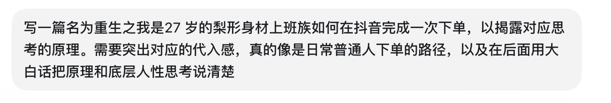
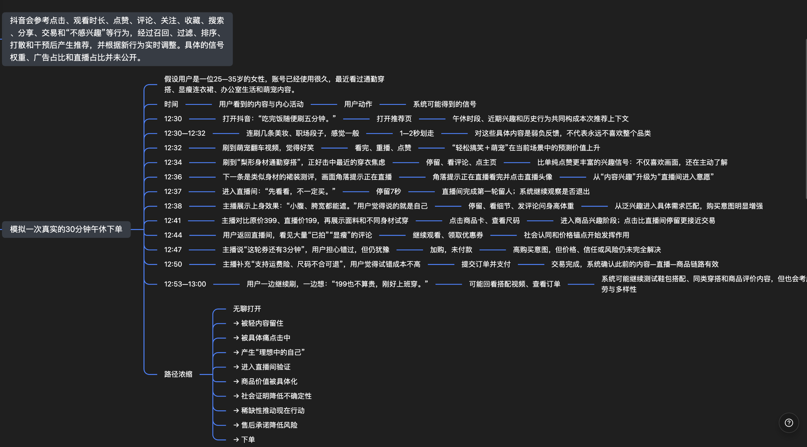
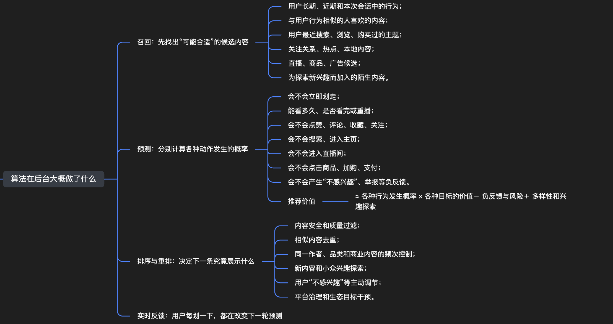
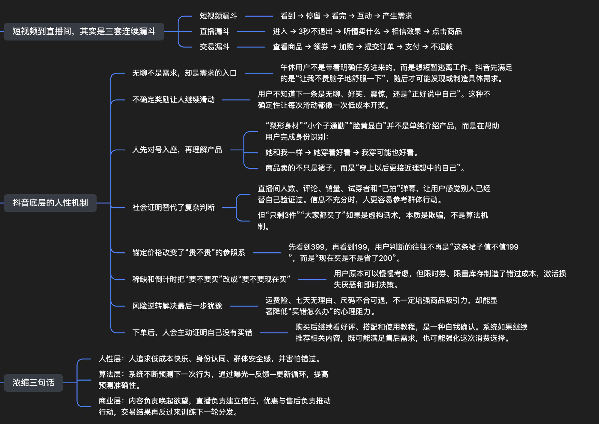

# douyin-底层算法逻辑分享

## 重生之我是27岁的梨形身材上班族，如何在抖音完成一次下单

> 来源：[飞书原文](https://my.feishu.cn/docx/QtwWdtt7aoQ3O2xKPKWcyhiZnXf)  
> 作者：辫子哥哥

中午12点23分，我端着刚热好的外卖回到工位。

办公室的灯关了一半。有人趴在桌上午睡，有人戴着耳机看综艺。我的午休只剩三十多分钟，不想工作，也不想认真看什么，只想找点东西把脑子清空。

我打开抖音，对自己说：

“就刷五分钟。”

第一条是办公室段子。

老板在群里问“大家还有没有问题”，所有人集体沉默。我看了十几秒，笑了一下，划走。

第二条是只金毛偷吃主人外卖。我看完了，还顺手点了个赞。

第三条是护肤品广告。主播语速很快，我还没听清楚产品名，就划了过去。

第四条视频出现时，我的手停住了。

画面里，一个和我身材差不多的女生站在镜子前，字幕写着：

“梨形身材上班别再乱穿，这条裙子真的很藏胯。”

我下意识低头看了一眼自己。

今天穿的是一条黑色阔腿裤。早上出门前，我在镜子前换了三次衣服，最后还是选了这条最安全、也最没意思的裤子。

视频里的女生先穿了一条紧贴胯部的裙子，然后换上了一条收腰、下摆散开的连衣裙。腰线明显了，胯也看不出来。

我没有点赞，但把视频完整看完了。

视频自动重播时，我又看了一遍。

评论区第一条写着：

“胯宽腿粗的姐妹终于有救了。”

第二条问：

“主播身高体重多少？”

我点开回复，看见博主说自己162厘米、126斤。

我也是162厘米。

体重比她再多两斤。

这种时候，人很容易产生一种奇妙的信任感：她跟我差不多，她穿着好看，那我应该也不会太差。

我点进博主主页，又看了两条穿搭视频。

退回推荐页后，下一条仍然是通勤穿搭。模特穿着一条深蓝色连衣裙转了一圈，右侧头像外面有一圈闪动的提示：

“正在直播。”

本来我没有买衣服的打算。

但我想看看这条裙子的正面。

于是我点进了直播间。

## 我只是看看，不一定买

进入直播间的前三秒，我其实有点想退出。

主播说话很快，背景音乐也吵，屏幕上不断飘过“已抢到”“我买了”“显瘦”的评论。

我准备划走时，主播刚好拉过来一个模特：

“来，给梨形身材的姐妹看一下。她胯比较宽，但是这个版型穿上以后，胯的位置完全不会卡。”

我停住了。

模特侧过身，主播用手比划腰线和裙摆。

“你看，它不是靠勒腰显瘦，而是把视觉重点放在腰最细的位置。肚子这里也有空间，中午吃完饭不会鼓出来。”

“中午吃完饭不会鼓出来。”

这句话精准击中了此刻坐在工位上、刚吃完一份盖饭的我。

我开始觉得，这件衣服不是展示给所有人的。

它像是在展示给我。

主播继续说：

“上班、见客户、参加聚会都能穿。不是只能拍照，平时穿也不会夸张。”

我点开了商品卡。

直播价199元，页面显示领券再减20元。

179元。

不算特别便宜，但也没有贵到需要认真做预算。

我翻了翻买家秀。

有人说显瘦，有人说面料垂感不错，也有人说收到时有点皱。我退回直播间，正好听见主播说：

“有姐妹问会不会皱。这个不是完全不会皱的面料，快递拿出来稍微挂一下就可以。大家不要听那种‘永远不起皱’的话，不现实。”

这句话反而让我觉得她挺诚实。

我在评论区打了一句：

“162，128斤，胯宽，穿什么码？”

消息很快被弹幕淹没。

过了十几秒，主播看着屏幕说：

“162、128斤那位姐妹，如果上半身正常、胯比较宽，建议L码。不要为了显瘦硬拍M，裙子合身才显瘦。”

我不知道她是不是在回答我。

但我愿意相信她是在回答我。

我点了L码，加入购物车。

然后没有付款。

## 真正让人下单的，通常不是一句话

购物车里显示：

“优惠券剩余02:48。”

主播在说这轮库存不多，弹幕不断出现“已拍”。

我对这种话术并不陌生。

我知道库存可能没有那么少，倒计时结束后也可能还有下一轮优惠。我甚至想起家里衣柜里还有两条不常穿的连衣裙。

“真的需要吗？”

“会不会又是直播间看着好看，买回来就一般？”

“179块也能吃好几顿饭了。”

我退出直播间，又刷了两条视频。

但我没有完全忘记那条裙子。

第一条视频没看进去。

第二条还是穿搭内容。我看着别人把普通衬衫塞进半身裙里，脑子里想的却是：刚才那条裙子，好像确实挺适合上班。

我重新点进刚才的直播间。

主播已经换了另一个颜色。

深灰色比深蓝色更日常，搭一件西装外套应该也可以。我甚至开始想象下周开会时穿它的样子。

这时候，我已经不是在判断“一条陌生的裙子值不值179元”。

我是在判断“那个穿上以后显得利落一点的自己，值不值179元”。

我再次打开商品页面，确认了几件事：

有运费险。

支持七天无理由退货。

买家秀里有和我身材接近的人。

店铺评分不算差。

这些信息没有让裙子变得更好看，却让买错的后果变得没那么严重。

倒计时还剩47秒。

我按下付款。

时间是12点51分。

从打开抖音到完成支付，一共28分钟。

我本来只是想刷五分钟。

## 如果把镜头移到屏幕后面

从我的视角看，这是一段很普通的午休：

我无聊，刷到一条穿搭视频，进入直播间，觉得价格能接受，最后买了一条裙子。

但从推荐系统的视角看，这28分钟里发生的不是一个动作，而是一连串回答。

我快速划走护肤品广告，意味着这条内容没有留住我。

我看完梨形身材穿搭，意味着主题可能与我有关。

我重播、看评论、点主页，意味着这不是随便看看，而是在主动寻找更多信息。

我进入直播间，意味着兴趣从“内容”向“商品场景”靠近。

我点击商品卡、查看尺码、翻买家秀，意味着购买意愿进一步增强。

我加入购物车却没有付款，说明我想要，但仍然存在顾虑。

我退出后又返回，说明这件商品已经在我脑子里占据了位置。

最后完成支付，才让整条路径真正闭环。

算法不需要知道我在想什么。

它只需要观察：给我看了什么，我接下来做了什么。

## 抖音真的知道我是“梨形身材”吗？

不一定。

它可能并没有一个清清楚楚的标签写着：

“27岁，梨形身材，上班族，最近想买连衣裙。”

真实的推荐系统，也不是简单地给每个人装上几十个固定标签。

它更可能根据我过去和现在的行为，不断计算：

我有多大概率看完这条视频？

我会不会点开评论区？

我会不会进入这个直播间？

我会不会点击这件商品？

我会不会付款？

如果我连续看了几条通勤穿搭，又搜索过“梨形身材怎么穿”，系统就不需要真正理解我的身材。它只需要发现：这类内容出现在我面前时，我更容易停下来。

所谓“越来越懂我”，很多时候不是它看穿了我，而是我通过一次次停留、划走和点击，把答案交给了它。

## 这次下单，真正利用了哪些人性？

第一，是无聊。

我打开抖音时没有购物需求，只是想从工作中短暂逃离。无聊让人愿意接受刺激，而不断滑动几乎不需要任何思考成本。

第二，是对号入座。

“梨形身材”四个字把一条普通裙子变成了“可能适合我的裙子”。人天然会关注与自己有关的信息。越具体的身份描述，越容易让人产生“她在说我”的感觉。

第三，是对理想自我的想象。

我想买的并不只是布料和版型。我想买的是一种可能：穿上以后，自己能不能显得更瘦、更利落、更像一个从容的职场女性。

很多商品真正出售的，都不是商品本身，而是消费者对另一个自己的想象。

第四，是社会证明。

买家秀、直播人数、“已拍”弹幕和其他人的评价，都在替我降低判断成本。当我们无法完全判断一件商品时，很容易借用别人的选择告诉自己：

“这么多人买，应该不会太差。”

第五，是价格锚定。

当直播间先展示原价，再展示券后价时，我思考的重点会从“这条裙子值不值179元”，变成“现在买是不是省了一笔钱”。

参照物变了，感受到的价格也就变了。

第六，是害怕错过。

倒计时和库存提醒没有证明商品更好，却迫使我现在做决定。

原本的问题是：

“我要不要买？”

后来变成了：

“如果现在不买，我会不会错过这个价格？”

人对失去的敏感，往往大于对得到的期待。

第七，是降低后悔成本。

运费险和七天无理由退货没有提高裙子的质量，却让我觉得：

“先买回来试试，不合适再退。”

购买风险一旦被降低，最后一道心理门槛也就松动了。

## 算法不是按着我的手付款

必须说清楚的是：算法没有强迫我下单。

它做的事情，是把最可能让我停留的内容排到前面，再把我的每一次反应变成下一轮推荐的依据。

内容负责让我停下来。

相似身份负责让我代入。

直播负责建立信任。

买家秀负责提供证明。

优惠和倒计时负责推动行动。

运费险负责降低风险。

最后，我自己按下了付款按钮。

这套系统最厉害的地方，不是突然说服一个完全不想买东西的人，而是连续消除那些阻止下单的小问题。

适不适合我？

看起来适合。

效果是真的吗？

有人试穿，也有买家秀。

价格贵不贵？

好像在预算以内。

买错怎么办？

可以退，还有运费险。

要不要再等等？

优惠快结束了。

没有哪一个理由单独足以让我付款。但当所有理由连续出现时，“先买回来试试”就成了最轻松的选择。

## 最后

午休结束前，我关掉抖音，重新打开工作群。

裙子还没有发货，我已经开始想象它配哪双鞋、哪件外套。

这可能就是抖音电商最底层的一条路径：

先用内容发现你的情绪，再用具体场景唤醒需求；先让你看见理想中的自己，再用信任、价格、群体选择和低风险承诺，把想象一步步变成订单。

我们以为自己只是在刷视频。

系统看到的却是一次次停留、一次次犹豫，以及欲望逐渐成形的全过程。

它未必比我们更懂我们自己。

它只是比我们更耐心地记录了每一次心动。

---

## 创作说明

为什么要以这部分内容去写抖音的一次下单，并且还是以代入式，当然写是我的 agent 写的。但给我极大的冲击。作为抖音或者小红书从业者，我似乎从来没有拆得那么细过。于是以我对应做好的脑图，让它写了一份对应的小说。看似是小说，其实是我们模拟用户真实反馈的一种方式。

用户究竟会在什么样的场域里，被什么样的细节影响，从而一步一步进行购买？

这是提示词。

辫子20年因为罗永浩才下的抖音，买了些产品后光速删除。22年因为工作才下的抖音，但几乎没有怎么刷新；24年可能有了点购物习惯，也会分享；25年、26年，本地生活以及电商每年基本上会花三五千块钱。说来惭愧，从22年开始从事对应工作，但直到今天前才开始慢慢模拟用户的路径。

大家都说抖音的算法厉害，也一直在说对应的算法逻辑、系数，但好像没有真正以“模拟＋拆解”的方式去做分析。在当前的 AI Agent 时代，我也分享一下我最新的抖音推荐算法逻辑拆解。

大家可以截图然后喂给自己的 Agent。如果是电商从业者，可以把对应的内容直接给到不同产品，看看消费者到底在想什么，大概可以摸到一个框架。

注重消费者的体验，才是未来持续卖货的根本。

### 模拟一次真实的30分钟午休下单

### 算法在后台大概做了什么

### 抖音底层的人性机制

---

我是辫子，一个用 AI＋出海想要最大化电商收益的男人。

联系方式：bianzigege98

爱大家。
